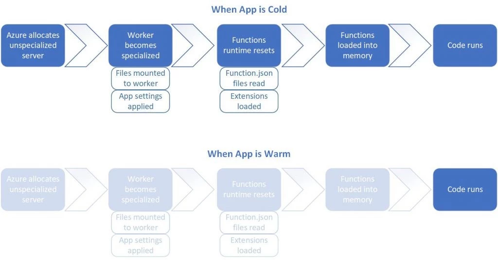
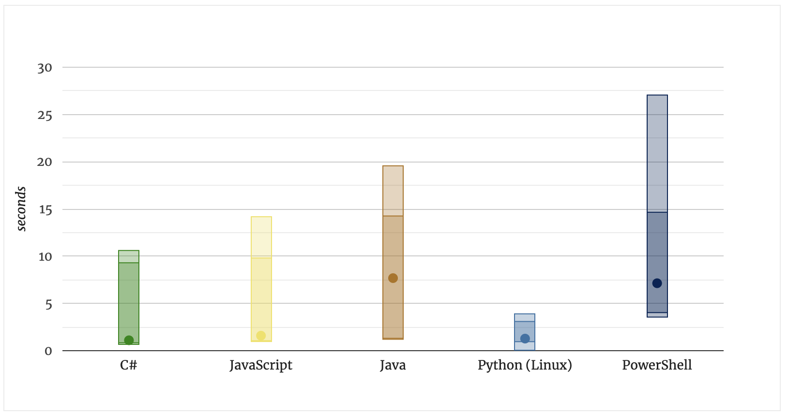

# Terraform Functions

## What is it?

Azure Functions is a serverless compute service on Microsoft Azure. It allows running event-triggered code without managing infrastructure. 

A Function App groups multiple functions as a single deployment. Each function can have its own trigger and function, supporting a microservices architecture. This setup simplifies deployment, scaling, and management.

---

### Azure Functions - subscription models

* **Consumption plan**: Pay for the time that your code runs. This is **serverless**. 

* **Premium plan**: You specify a number of pre-warmed instances that are always online. 

* **App service plan**: Run as if they are web apps. Not serverless.

---

### Why serverless?

Saves time. Easier to deploy.

Scalable. 

Saves money. (Azure Functions Different pricing plans.)

---

### Azure Functions - Ways to deploy

* In the browser.

* Terminal. 

* IDE (extensions).

* IaC tools. 

---

### Tools for local development

Tools: 

- CLI

- Visual Studio

- VS Code (extension)

- Storage emulators (local)

---

### Cold starts - A problem

Cold start: The time it takes to allocate the function to a server and setup the runtime environment before your code can run.

Functions are held warm for roughly 20 minutes according to below source.

(Source: https://azure.microsoft.com/en-us/blog/understanding-serverless-cold-start/)

---

### More cold start metrics

(Source: https://mikhail.io/serverless/coldstarts/azure/)

---

### Triggers and bindings

https://learn.microsoft.com/en-us/azure/azure-functions/functions-triggers-bindings?tabs=isolated-process%2Cpython-v2&pivots=programming-language-csharp#supported-bindings

---

## Let's get started using Terraform

[Next Lesson =>](./01._Init.md)
